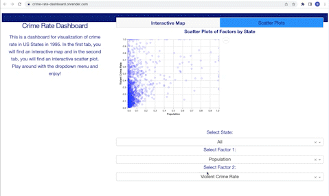

# Welcome to Communities and Crime!

# Index
------------------------------------------------------------------------

# Index

-   [Welcome](#Welcome!)
-   [Motivation](#Motivation)
-   [Dashboard Usage](#Dashboard_Usage)
-   [Running Locally](#Running-Locally)
-   [Contributing](#Contributing)
-   [License](#License)
-   [Authors](#Authors)
-   [Reference](#Reference)

<!-- #region -->

# Welcome!
This is the [lite dash version](https://crime-rate-dashboard.onrender.com/) of the [**Communities and Crime Rshiny dashboard**](https://github.com/UBC-MDS/Communites_and_Crime_group8).

In this README you will find all the information you will need to set up, use and contribute to the Communities and Crime Dashboard. Please follow the [Contributing Guidelines](CONTRIBUTING.md) and be mindful of the [Code of Conduct](CODE_OF_CONDUCT.md). Please enjoy and I hope this dashboard is of use on your projects!


## Motivation

The crime rate in a community is an important factor that citizens consider when making decisions about whether to live or invest. A high crime rate in a city may impact personal safety, property values, and overall quality of life and is influenced by many factors. Understanding where, how and why crime happens is important for fighting and lowering crime rates, hence increasing safety in communities. Since 1930, the FBI has been collecting data on the types, amounts, and impact of crime in the United States through the Uniform Crime Reporting Program. So, our dashboard will aim to figure out the socioeconomic conditions, socio-demographic and community factors influencing crime rates in different US states as well as provide access to crime data in an understandable and intuitive manner. A proposal with a persona can be found [here](https://github.com/UBC-MDS/Communites_and_Crime_group8/blob/main/reports/proposal.md), describing example usage scenarios and functionality.


## Dashboard Usage

The Crime Rate Finder App contains an interactive map as a landing page that will show the violent crimes committed in the Continental United States of America by State and County.

The following steps illustrate how the user could interact with the dashboard using the link on top or locally:

- Entering the main page of the dashboard, you can see a short description of the app and an overview of the two tabs and what they represent



- The left-hand tab shows an interactive plotly map where you can change what the dots represent from the drop-down menu, to view the distribution of that specific factor across states in the US. You can scroll in and out of the map as well.


- The right-hand tab shows an altair scatterplot of two factors and a state of your choice, with an interactive tool to view the coordinates of the x and y axis as well.


## Running Locally

### Requirements

* Python 3.11.0

I suggest you to create a virtual environment for running this app with Python 3.11. 
1) Clone this repository and open your terminal/command prompt in the root folder.

```
git clone https://github.com/missarah96/communities_dash.git

```
2) Create the environment file from `root` folder:

```
conda env create -f dataviz-532.yaml
conda activate dataviz-532

```

3) Navigate to `src` folder and install all required packages by running:
```
pip install -r requirements.txt
```

4) Run this app locally with, also from `src` folder:
```
python app.py
```

## Contributing

Interested in contributing? Check out the contributing guidelines [here](CONTRIBUTING.md). We would love to know what other datasets we can bring into our dashboard to make it more useful. Please also feel free to offer suggestions on other interactive options you'd like to see. Please note that this project is released with a [Code of Conduct](CODE_OF_CONDUCT.md). By contributing to this project, you agree to abide by its terms.

## License

Please refer to our license file [here](LICENSE.md).

## Authors

-   Sarah Abdelazim

<!-- #endregion -->


## Reference

The data set can be found [here](https://archive.ics.uci.edu/ml/datasets/communities+and+crime). For more information on US crime rates, you can visit the [FBI Crime Report](https://ucr.fbi.gov/crime-in-the-u.s).


